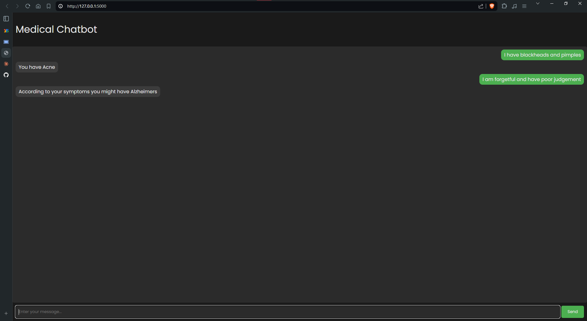

# Medical AI Chatbot with Flask

This project implements an AI-powered medical chatbot using a neural network model and serves it through a Flask web application.

## Table of Contents

1. [Project Overview](#project-overview)
2. [Installation](#installation)
3. [Project Structure](#project-structure)
4. [Model Architecture](#model-architecture)
5. [How It Works](#how-it-works)
6. [Usage](#usage)
7. [Screenshots](#screenshots)

## Project Overview

This AI chatbot uses natural language processing and machine learning techniques to understand user input and generate appropriate responses. The core of the system is a neural network model trained on predefined intents, which is then served through a Flask web application for easy interaction.

## Installation

1. Clone the repository:

```bash
git clone https://github.com/Arnie1x/medical_chatbot.git
cd medical_chatbot
```

2. Create a virtual environment (optional but recommended):

```bash
python -m venv venv
source venv/bin/activate  # On Windows, use venv\Scripts\activate
```

3. Install the required packages:

```bash
pip install -r requirements.txt
```

## Usage

1. Train the model (this will also download the necessary NLTK Data):

```bash
python model.py
```

2. Run the Flask Application:

```
python chatbot.py
```

3. Open a web browser and navigate to localhost at http://127.0.0.1:5000 to interact with the chatbot.

## Project Structure

- `chatbot.py`: Main Flask application file
- `model.py`: Script for training the neural network model
- `intents.json`: JSON file containing predefined intents and responses
- `words.pkl`: Pickle file storing processed vocabulary
- `classes.pkl`: Pickle file storing intent classes
- `chatbot_model.h5`: Trained neural network model
- `requirements.txt`: List of Python dependencies
- `templates/index.html`: HTML template for the chatbot interface (not provided in the given files)

## Model Architecture

The chatbot uses a feed-forward neural network with the following architecture:

1. Input Layer: Dense layer with 256 neurons (ReLU activation)
2. Dropout Layer: 50% dropout for regularization
3. Hidden Layer: Dense layer with 128 neurons (ReLU activation)
4. Dropout Layer: 50% dropout for regularization
5. Output Layer: Dense layer with neurons equal to the number of intent classes (Softmax activation)

The model is compiled using:

- Loss function: Categorical Cross-Entropy
- Optimizer: Stochastic Gradient Descent (SGD) with learning rate 0.01 and momentum 0.9
- Metric: Accuracy

## How It Works

### Data Preprocessing:

- The `intents.json` file is parsed to extract patterns and their corresponding intents.
- Words are tokenized, lemmatized, and converted into a bag-of-words representation.


### Model Training (`model.py`):

- The preprocessed data is used to train the neural network.
- The model is trained for 200 epochs with a batch size of 5.
- Trained model and processed data are saved for later use.


### Chatbot Implementation (`chatbot.py`):

- The Flask application loads the trained model and preprocessed data.
User input is processed using the same preprocessing steps as during training.
- The model predicts the most likely intent for the input.
- A response is selected randomly from the predicted intent's responses.


### Web Interface:

- Flask serves an HTML page with a chat interface.
- User messages are sent to the server via POST requests.
- The chatbot's responses are displayed in the chat interface.

## Screenshots
